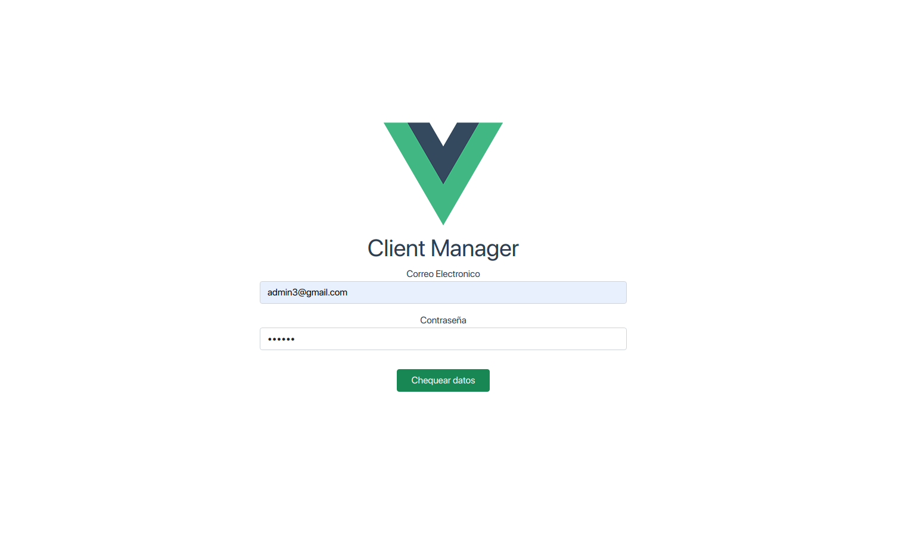
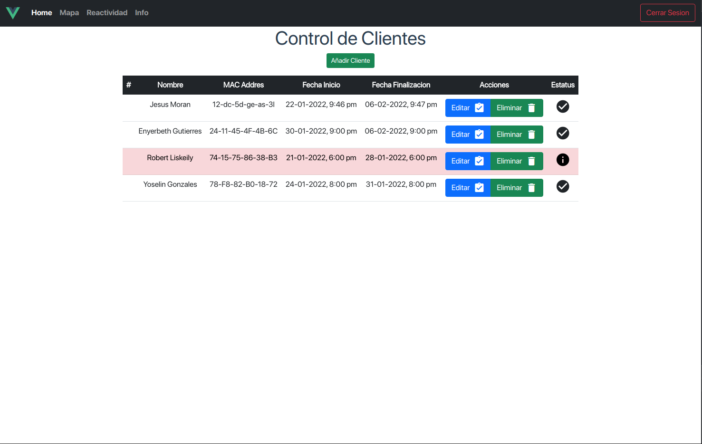
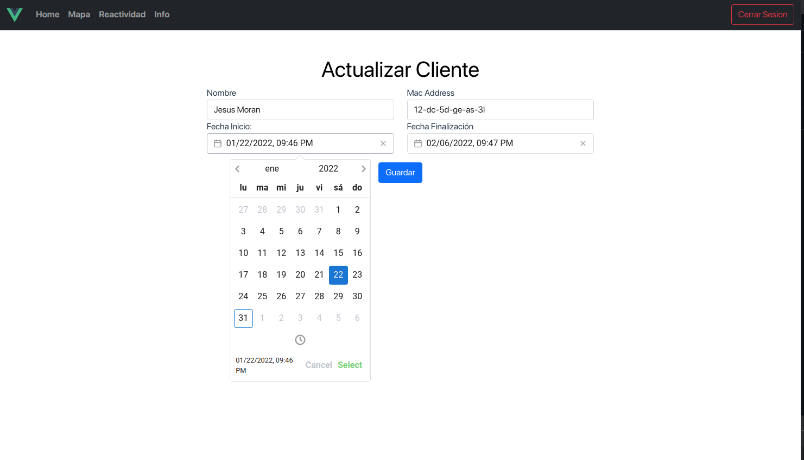
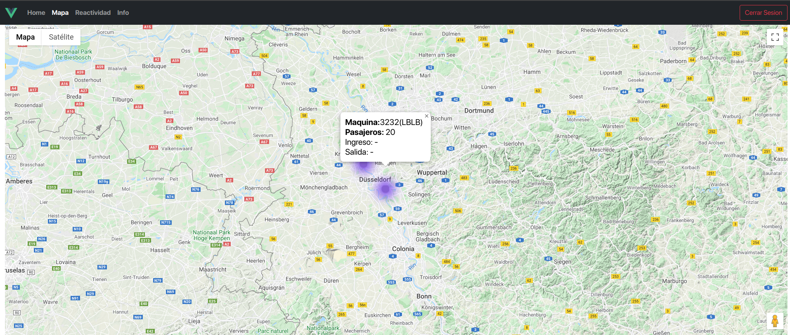
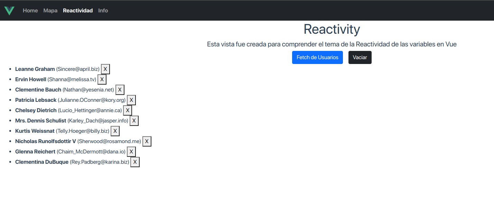
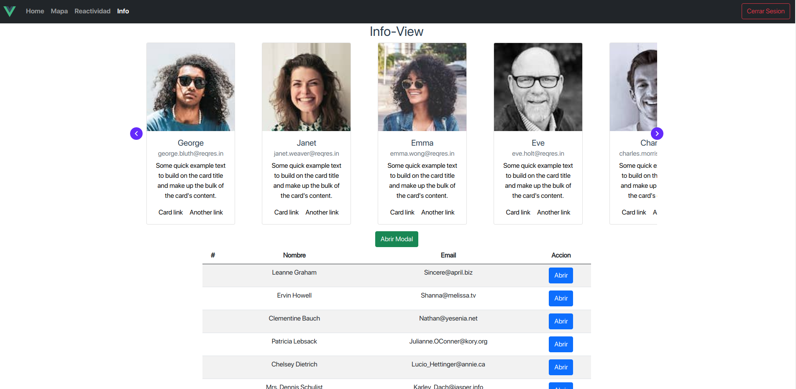
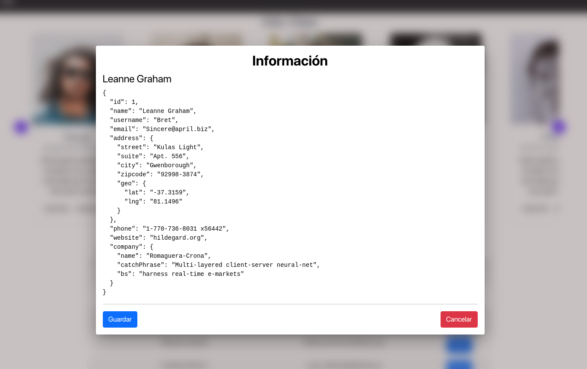
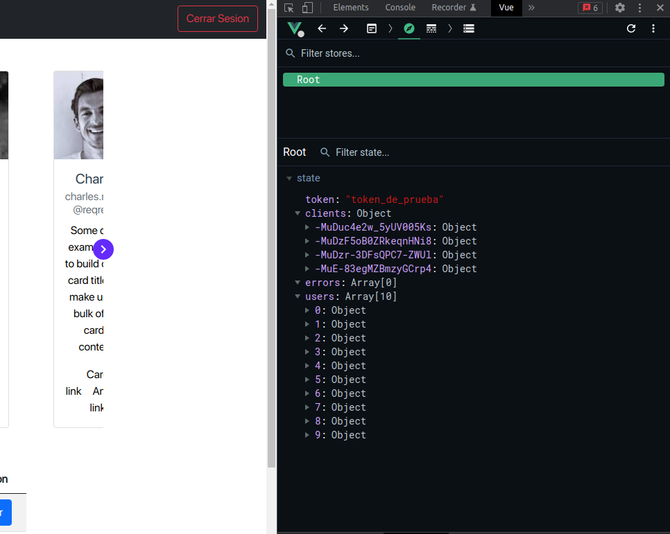

# client-manager

Practical Client Manager type application, it was intended to be a single section but this project has several practical features with some dependencies that can be used in real life projects: VeeValidate for form validation that streamlines the management of forms, Vue-google-maps is already preconfigured component easy to use with Google Maps, Gitart-vue-dialog a very editable and user friendly modal component, Vue3-date-time-picker a very good date and time picker also with additions, could not miss Vuex for the management of the global state of the application.










## Project setup

```
npm install
```

### Compiles and hot-reloads for development

```
npm run serve
```

### Compiles and minifies for production

```
npm run build
```

### Lints and fixes files

```
npm run lint
```

### Customize configuration

See [Configuration Reference](https://cli.vuejs.org/config/).
